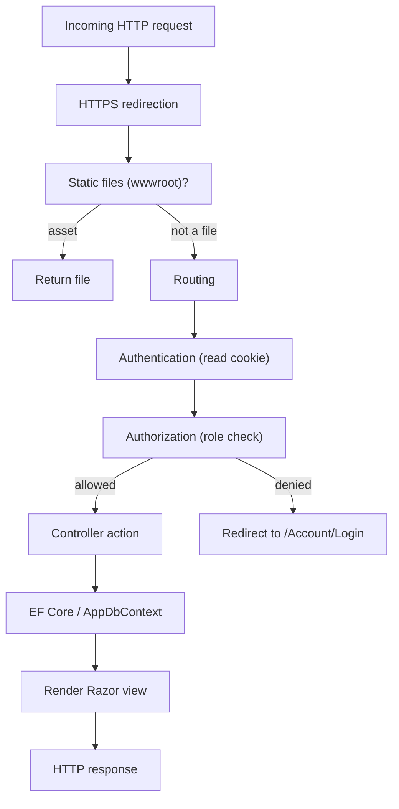
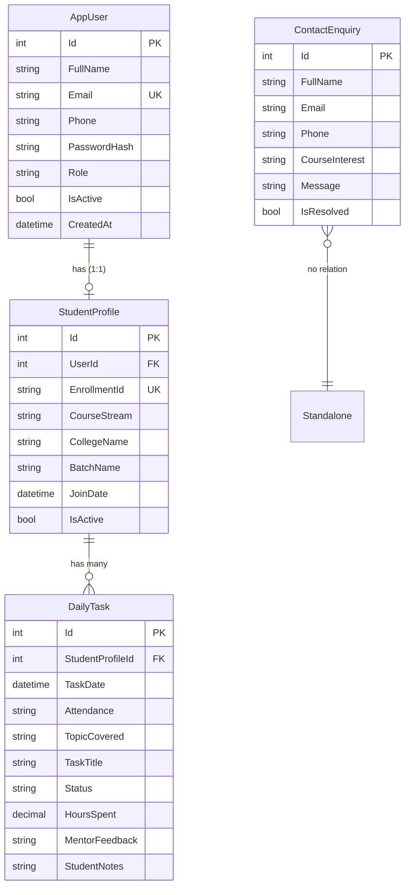
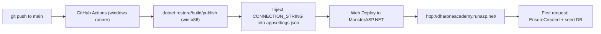

# Dharone Academy — Complete Project Guide (From Scratch to Deploy)

This document explains the **entire project end-to-end**: what it is, how every layer works (starting at `Program.cs`), the data model, authentication, every controller/route, the frontend, configuration, and finally how it is built and deployed to production.

It is written to be readable by someone who has never seen the codebase before.

---

## Table of contents

1. [What this project is](#1-what-this-project-is)
2. [Technology stack](#2-technology-stack)
3. [Project structure](#3-project-structure)
4. [The startup pipeline — `Program.cs`](#4-the-startup-pipeline--programcs)
5. [Configuration & options](#5-configuration--options)
6. [The data layer](#6-the-data-layer)
7. [Database seeding & first-run behavior](#7-database-seeding--first-run-behavior)
8. [Authentication & authorization](#8-authentication--authorization)
9. [Controllers, actions & routes](#9-controllers-actions--routes)
10. [View models](#10-view-models)
11. [Views & frontend](#11-views--frontend)
12. [Firebase analytics](#12-firebase-analytics)
13. [Running locally](#13-running-locally)
14. [Build & publish](#14-build--publish)
15. [Deployment](#15-deployment)
16. [CI/CD workflows](#16-cicd-workflows)
17. [Secrets & configuration in production](#17-secrets--configuration-in-production)
18. [Security notes](#18-security-notes)
19. [Troubleshooting](#19-troubleshooting)

---

## 1. What this project is

**Dharone Academy** is a production ASP.NET Core MVC web application that serves as both:

- a **public marketing website** for an academy/internship program (Home, Program, Curriculum, Career, About, Contact), and
- a **student portal** with secure login, a dashboard, a daily-task tracker, student management, and contact enquiry handling.

It is a **server-rendered** application (Razor views), backed by a **SQL Server** database via Entity Framework Core, with **cookie-based authentication** and two roles: `Admin` and `Student`.

Live production URL: http://dharoneacademy.runasp.net/

---

## 2. Technology stack

| Layer | Technology |
|-------|-----------|
| Runtime | .NET 8 (`net8.0`) |
| Web framework | ASP.NET Core MVC (Controllers + Razor Views) |
| ORM | Entity Framework Core 8 |
| Database | Microsoft SQL Server |
| Auth | Cookie authentication (`Microsoft.AspNetCore.Authentication.Cookies`) |
| Password hashing | `BCrypt.Net-Next` |
| Analytics | Firebase Analytics (client-side script) |
| Frontend | Razor + Bootstrap (in `wwwroot/lib`) + custom CSS |
| Hosting (prod) | MonsterASP.NET (free tier, IIS + MSSQL) |
| CI/CD | GitHub Actions |

NuGet packages (from `DharoneAcademy.csproj`):
- `BCrypt.Net-Next` 4.2.0
- `Microsoft.EntityFrameworkCore.SqlServer` 8.0.11
- `Microsoft.EntityFrameworkCore.Design` 8.0.11
- `Microsoft.EntityFrameworkCore.Tools` 8.0.11

---

## 3. Project structure

```
dharoneAcademy/
├── Program.cs                     # App entry point & pipeline configuration
├── DharoneAcademy.csproj          # Project file (net8.0, packages)
├── DharoneAcademy.sln             # Solution file
├── appsettings.json               # Production config (SQL Server, Firebase, academy info)
├── appsettings.Development.json   # Dev config (LocalDB)
│
├── Controllers/                   # MVC controllers (request handlers)
│   ├── HomeController.cs          # Public marketing pages
│   ├── AccountController.cs       # Login / Register / Logout
│   ├── DashboardController.cs     # Authenticated dashboard
│   ├── StudentsController.cs      # Admin-only student CRUD
│   ├── DailyTasksController.cs    # Daily task tracker CRUD
│   └── ContactController.cs       # Contact form + admin enquiries
│
├── Models/                        # Domain entities & view models
│   ├── AppUser.cs                 # User account
│   ├── StudentProfile.cs          # Student details (1:1 with AppUser)
│   ├── DailyTask.cs               # A student's daily task/attendance record
│   ├── ContactEnquiry.cs          # Contact form submissions
│   ├── ErrorViewModel.cs
│   └── ViewModels/
│       └── AuthAndDashboardViewModels.cs  # Login/Register/Dashboard VMs
│
├── Data/
│   ├── AppDbContext.cs            # EF Core DbContext + model configuration
│   └── DbInitializer.cs           # Creates DB & seeds demo data on startup
│
├── Options/
│   └── FirebaseOptions.cs         # Strongly-typed Firebase config binding
│
├── Views/                         # Razor views (.cshtml)
│   ├── Home/                      # Index, Program, Curriculum, Career, About, Privacy
│   ├── Account/                   # Login, Register
│   ├── Dashboard/                 # Index
│   ├── Students/                  # Index, Details, Edit, Delete
│   ├── DailyTasks/                # Index, Create, Edit, Delete, _TaskForm
│   ├── Contact/                   # Index, Enquiries
│   └── Shared/                    # _Layout, Error, _FirebaseAnalytics, etc.
│
├── wwwroot/                       # Static assets (css, js, images, bootstrap lib)
│
├── firebase-hosting/
│   └── index.html                 # Static landing placeholder (Firebase/GitHub Pages)
├── firebase.json / .firebaserc    # Firebase Hosting config
│
├── scripts/
│   └── deploy-azure.ps1           # Optional Azure deployment script
│
├── docs/                          # Documentation (this file lives here)
└── .github/workflows/             # CI/CD pipelines
    ├── monsterasp-deploy.yml      # ACTIVE: builds & deploys the real app
    ├── azure-deploy.yml           # Alternate Azure deployment
    └── gh-pages.yml               # Publishes the static placeholder
```

---

## 4. The startup pipeline — `Program.cs`

`Program.cs` is the application entry point. It uses the .NET 8 minimal hosting model. Here is what each part does, in order:

```1:11:Program.cs
using DharoneAcademy.Data;
using DharoneAcademy.Options;
using Microsoft.AspNetCore.Authentication.Cookies;
using Microsoft.EntityFrameworkCore;

var builder = WebApplication.CreateBuilder(args);

builder.Services.Configure<FirebaseOptions>(builder.Configuration.GetSection(FirebaseOptions.SectionName));
builder.Services.AddControllersWithViews();
builder.Services.AddDbContext<AppDbContext>(options =>
    options.UseSqlServer(builder.Configuration.GetConnectionString("DefaultConnection")));
```

**Service registration (dependency injection):**
1. `Configure<FirebaseOptions>(...)` — binds the `"Firebase"` section of configuration to a strongly-typed `FirebaseOptions` object, injectable anywhere.
2. `AddControllersWithViews()` — registers MVC (controllers + Razor views).
3. `AddDbContext<AppDbContext>(...)` — registers the EF Core database context using the SQL Server provider and the `DefaultConnection` connection string.

**Authentication & authorization:**
```13:26:Program.cs
builder.Services.AddAuthentication(CookieAuthenticationDefaults.AuthenticationScheme)
    .AddCookie(options =>
    {
        options.LoginPath = "/Account/Login";
        options.LogoutPath = "/Account/Logout";
        options.AccessDeniedPath = "/Account/Login";
        options.SlidingExpiration = true;
        options.ExpireTimeSpan = TimeSpan.FromHours(10);
        options.Cookie.HttpOnly = true;
        options.Cookie.SecurePolicy = CookieSecurePolicy.SameAsRequest;
        options.Cookie.Name = "DharoneAcademy.Auth";
    });

builder.Services.AddAuthorization();
```
- Cookie auth is the scheme. Unauthenticated users hitting a protected page are redirected to `/Account/Login`.
- The auth cookie (`DharoneAcademy.Auth`) is `HttpOnly`, lasts 10 hours, and uses sliding expiration (renews on activity).

**The HTTP middleware pipeline:**
```28:44:Program.cs
var app = builder.Build();

if (!app.Environment.IsDevelopment())
{
    app.UseExceptionHandler("/Home/Error");
    app.UseHsts();
}

app.UseHttpsRedirection();
app.UseStaticFiles();
app.UseRouting();
app.UseAuthentication();
app.UseAuthorization();

app.MapControllerRoute(
    name: "default",
    pattern: "{controller=Home}/{action=Index}/{id?}");
```
Order matters here. A request flows through:
1. Exception handler + HSTS (production only)
2. HTTPS redirection
3. Static files (serves `wwwroot`)
4. Routing
5. Authentication (who are you?)
6. Authorization (are you allowed?)
7. MVC endpoint routing — default route is `{controller=Home}/{action=Index}/{id?}`, so `/` maps to `HomeController.Index`.

**Database initialization on boot:**
```46:56:Program.cs
try
{
    await DbInitializer.InitializeAsync(app.Services);
}
catch (Exception ex)
{
    var logger = app.Services.GetRequiredService<ILoggerFactory>().CreateLogger("Startup");
    logger.LogError(ex, "Database initialization failed. Check SQL Server connection string in appsettings.");
}

app.Run();
```
On startup the app ensures the database exists and is seeded (see [§7](#7-database-seeding--first-run-behavior)). If the DB connection fails, it logs an error but still starts.

### Request lifecycle diagram



---

## 5. Configuration & options

### `appsettings.json` (production)
- **`ConnectionStrings:DefaultConnection`** — SQL Server connection. In the repo it points at a local `SQLEXPRESS`; in production it is overwritten at deploy time (see [§16](#16-cicd-workflows)).
- **`Academy`** — branding/contact info (name, tagline, phone, email, fees, timings).
- **`Firebase`** — analytics configuration (project id, API key, app id, measurement id).

### `appsettings.Development.json`
- Uses `(localdb)\mssqllocaldb` for local development and more verbose logging.

### `Options/FirebaseOptions.cs`
A strongly-typed binding of the `"Firebase"` config section:

```16:24:Options/FirebaseOptions.cs
    public bool IsAnalyticsConfigured =>
        AnalyticsEnabled
        && !string.IsNullOrWhiteSpace(ApiKey)
        && !string.IsNullOrWhiteSpace(AppId)
        && !string.IsNullOrWhiteSpace(MeasurementId)
        && !ApiKey.Contains("YOUR_", StringComparison.OrdinalIgnoreCase)
        && !AppId.Contains("YOUR_", StringComparison.OrdinalIgnoreCase);
```
`IsAnalyticsConfigured` is a guard so views only emit the Firebase script when real credentials (not placeholders) are present.

---

## 6. The data layer

### Entities (`Models/`)

**`AppUser`** — a user account.
- `Id`, `FullName`, `Email` (unique), `Phone`, `PasswordHash` (BCrypt), `Role` (`Admin`/`Student`), `IsActive`, `CreatedAt`.
- Navigation: optional 1:1 `StudentProfile`.

**`StudentProfile`** — student-specific details, one per student user.
- `Id`, `UserId` (FK → `AppUser`), `EnrollmentId` (unique, e.g. `DA-2026-001`), `CourseStream` (default `BCA`), `CollegeName`, `BatchName`, `JoinDate`, `IsActive`.
- Navigation: `User` (1:1), `DailyTasks` (1:many).

**`DailyTask`** — a single daily tracker entry for a student.
- `Id`, `StudentProfileId` (FK), `TaskDate`, `Attendance` (`Present`/…), `TopicCovered`, `TaskTitle`, `Status` (`Pending`/`In Progress`/`Completed`), `HoursSpent` (decimal(5,2)), `MentorFeedback`, `StudentNotes`, `CreatedAt`.

**`ContactEnquiry`** — a public contact-form submission.
- `Id`, `FullName`, `Email`, `Phone`, `CourseInterest`, `Message`, `IsResolved`, `CreatedAt`.

### `AppDbContext`
Exposes four `DbSet`s: `Users`, `StudentProfiles`, `DailyTasks`, `ContactEnquiries`.

Model configuration in `OnModelCreating`:
- `AppUser.Email` → unique index.
- `StudentProfile.EnrollmentId` → unique index.
- `AppUser` ↔ `StudentProfile` → one-to-one, cascade delete.
- `StudentProfile` → `DailyTask` → one-to-many, cascade delete.
- `DailyTask.HoursSpent` → precision `decimal(5,2)`.

### Entity-relationship diagram



---

## 7. Database seeding & first-run behavior

`Data/DbInitializer.cs` runs at startup and:
1. Calls `db.Database.EnsureCreatedAsync()` — creates the schema if the database doesn't exist. (Note: this uses `EnsureCreated`, not EF migrations.)
2. If any users already exist, it stops (idempotent).
3. Otherwise it seeds:
   - An **Admin** user: `admin@dharoneacademy.com` / `Admin@123`
   - A **Student** user: `student@dharoneacademy.com` / `Student@123`
   - A sample `StudentProfile` (`DA-2026-001`), two sample `DailyTask`s, and one sample `ContactEnquiry`.

This means a brand-new empty database becomes fully usable on first request without any manual migration step.

> Because it uses `EnsureCreated`, schema changes to the models require dropping/recreating the database (or switching to EF migrations) rather than incremental migration.

---

## 8. Authentication & authorization

- **Sign-in** builds a `ClaimsPrincipal` with `NameIdentifier` (user id), `Name`, `Email`, and `Role`, then calls `HttpContext.SignInAsync(...)` to issue the cookie (`AccountController.SignInAsync`).
- **Passwords** are hashed and verified with BCrypt (`BCrypt.Net.BCrypt.HashPassword` / `.Verify`).
- **Persistence**: "Remember me" extends the cookie to 14 days; otherwise 10 hours.
- **Roles**:
  - `[Authorize]` — any signed-in user (Dashboard, DailyTasks).
  - `[Authorize(Roles = "Admin")]` — admin-only (Students, Contact enquiries).
- **Anti-forgery**: all state-changing POST actions use `[ValidateAntiForgeryToken]`.

Authorization outcomes are wired via `Program.cs`: unauthenticated → `/Account/Login`; access denied → also `/Account/Login`.

---

## 9. Controllers, actions & routes

Routing follows the default pattern `{controller}/{action}/{id?}`.

### HomeController (public, anonymous)
| Route | Purpose |
|-------|---------|
| `GET /` or `/Home/Index` | Landing/home page |
| `GET /Home/Program` | Internship program page |
| `GET /Home/Curriculum` | Curriculum page |
| `GET /Home/Career` | Career building page |
| `GET /Home/About` | About page |
| `GET /Home/Error` | Error page (no-cache) |

### AccountController (anonymous for login/register)
| Route | Purpose |
|-------|---------|
| `GET /Account/Login` | Show login form (redirects to Dashboard if already signed in) |
| `POST /Account/Login` | Validate credentials (BCrypt), sign in, redirect to `returnUrl` or Dashboard |
| `GET /Account/Register` | Show registration form |
| `POST /Account/Register` | Create `AppUser` + `StudentProfile` (auto `EnrollmentId`), sign in |
| `POST /Account/Logout` | Sign out (authorized) |

Registration auto-generates `EnrollmentId` as `DA-{year}-{count:D3}` and always assigns the `Student` role.

### DashboardController `[Authorize]`
| Route | Purpose |
|-------|---------|
| `GET /Dashboard` | Role-aware dashboard |

Behavior: Admins see all tasks/metrics; Students see only their own (filtered by their `StudentProfile`). Computes `TotalStudents`, `PresentToday`, `TasksPending`, `TasksCompleted`, `OpenEnquiries` (admin only), and the 8 most recent tasks.

### StudentsController `[Authorize(Roles = "Admin")]`
| Route | Purpose |
|-------|---------|
| `GET /Students?search=` | List/search students |
| `GET /Students/Details/{id}` | View one student + their tasks |
| `GET/POST /Students/Edit/{id}` | Edit student + linked user fields |
| `GET/POST /Students/Delete/{id}` | Delete student (cascades to user) |

### DailyTasksController `[Authorize]`
| Route | Purpose |
|-------|---------|
| `GET /DailyTasks?date=` | List tasks (students see only their own; optional date filter) |
| `GET/POST /DailyTasks/Create` | Add a task (students auto-assigned to themselves) |
| `GET/POST /DailyTasks/Edit/{id}` | Edit (only admin can set `MentorFeedback`) |
| `GET/POST /DailyTasks/Delete/{id}` | Delete |

Ownership is enforced by `CanAccessAsync`: non-admins can only touch tasks belonging to their own profile.

### ContactController
| Route | Purpose |
|-------|---------|
| `GET /Contact` | Public contact form |
| `POST /Contact` | Save a `ContactEnquiry` |
| `GET /Contact/Enquiries` | `[Admin]` list enquiries |
| `POST /Contact/Resolve/{id}` | `[Admin]` mark enquiry resolved |

---

## 10. View models

Defined in `Models/ViewModels/AuthAndDashboardViewModels.cs`:
- **`LoginViewModel`** — `Email`, `Password`, `RememberMe`.
- **`RegisterViewModel`** — `FullName`, `Email`, `Phone`, `CourseStream`, `CollegeName`, `Password`, `ConfirmPassword` (with `[Compare]` and `[MinLength(6)]`).
- **`DashboardViewModel`** — aggregated dashboard metrics + `RecentTasks`.

These keep controller inputs/outputs separate from the persistence entities.

---

## 11. Views & frontend

- **Razor views** live under `Views/<Controller>/<Action>.cshtml`; shared layout is `Views/Shared/_Layout.cshtml`.
- **`_ViewStart.cshtml`** sets the layout; **`_ViewImports.cshtml`** adds tag helpers/namespaces.
- **Static assets** (`wwwroot/`): Bootstrap (`lib/bootstrap`), site CSS (`css/site.css`), JS (`js/`), `images/`, `favicon.ico`. Served by `app.UseStaticFiles()`.
- **Branding**: navy `#002147` + gold `#C9A227`.
- **Flash messages**: controllers set `TempData["Success"]` which the layout renders after redirects.

---

## 12. Firebase analytics

- `Views/Shared/_FirebaseAnalytics.cshtml` emits the Firebase Analytics script, gated by `FirebaseOptions.IsAnalyticsConfigured` so it only runs with real credentials.
- The static `firebase-hosting/index.html` is a **separate** placeholder landing page (used by Firebase Hosting / GitHub Pages), not the real app.

---

## 13. Running locally

Prerequisites: .NET 8 SDK and SQL Server Express **or** LocalDB.

```bash
cd dharoneAcademy
dotnet restore
dotnet run
```

- Dev URLs (from `Properties/launchSettings.json`): `https://localhost:7168` and `http://localhost:5113`.
- On first run the DB is created and seeded automatically.
- Log in with the seeded accounts:

| Role | Email | Password |
|------|-------|----------|
| Admin | `admin@dharoneacademy.com` | `Admin@123` |
| Student | `student@dharoneacademy.com` | `Student@123` |

> Change the seeded admin password after first login in any real environment.

---

## 14. Build & publish

```bash
# Restore + build
dotnet restore
dotnet build --configuration Release

# Publish a deployable folder (Windows/IIS target used in production)
dotnet publish DharoneAcademy.csproj --configuration Release \
  --output ./publish --runtime win-x86 --self-contained false
```

The `publish` folder contains the compiled app plus a generated `web.config` for IIS hosting.

---

## 15. Deployment

### Current production host: MonsterASP.NET (free tier)

The real app runs on **MonsterASP.NET** (free ASP.NET Core + MSSQL hosting, IIS-based), deployed automatically by GitHub Actions.

- Live URL: http://dharoneacademy.runasp.net/
- Deployment mechanism: **Web Deploy** from GitHub Actions (see [§16](#16-cicd-workflows)).
- Database: a MonsterASP MSSQL database; the connection string is injected into `appsettings.json` at deploy time from a GitHub secret.



### Why not GitHub Pages?
GitHub Pages only serves **static files**. This app needs a .NET runtime + SQL Server, so Pages cannot run it. The `gh-pages.yml` workflow only publishes the static `firebase-hosting/index.html` placeholder.

### Alternate host: Azure App Service
`azure-deploy.yml` + `scripts/deploy-azure.ps1` provide an Azure App Service path (requires an Azure subscription and the `AZURE_WEBAPP_PUBLISH_PROFILE` secret). This is optional/alternate to MonsterASP.NET.

---

## 16. CI/CD workflows

All workflows live in `.github/workflows/` and trigger on push to `main`.

### `monsterasp-deploy.yml` (ACTIVE — the real app)
Steps:
1. Checkout, setup .NET 8.
2. `dotnet restore` / `build` / `publish` (`--runtime win-x86 --self-contained false`).
3. **Inject the SQL connection string** into `publish/appsettings.json` from the `CONNECTION_STRING` secret (PowerShell step).
4. Deploy via `rasmusbuchholdt/simply-web-deploy` using Web Deploy credentials.

```36:48:.github/workflows/monsterasp-deploy.yml
      - name: Deploy to MonsterASP.NET via WebDeploy
        uses: rasmusbuchholdt/simply-web-deploy@2.2.0
        with:
          website-name: ${{ secrets.WEBSITE_NAME }}
          server-computer-name: ${{ secrets.SERVER_COMPUTER_NAME }}
          server-username: ${{ secrets.SERVER_USERNAME }}
          server-password: ${{ secrets.SERVER_PASSWORD }}
          source-path: '\publish\'
```

### `gh-pages.yml`
Publishes `firebase-hosting/` to the `gh-pages` branch (static placeholder only).

### `azure-deploy.yml`
Builds and deploys to Azure App Service (`dharoneacademy-portal`) using `AZURE_WEBAPP_PUBLISH_PROFILE`. Only succeeds if that secret and the Azure resource exist.

---

## 17. Secrets & configuration in production

GitHub repository secrets used by the MonsterASP.NET workflow:

| Secret | Purpose |
|--------|---------|
| `WEBSITE_NAME` | MonsterASP site id (e.g. `siteXXXX`) |
| `SERVER_COMPUTER_NAME` | Web Deploy endpoint (e.g. `https://siteXXXX.siteasp.net:8172`) |
| `SERVER_USERNAME` | Web Deploy username |
| `SERVER_PASSWORD` | Web Deploy password |
| `CONNECTION_STRING` | MSSQL connection string injected into `appsettings.json` |
| `AZURE_WEBAPP_PUBLISH_PROFILE` | (Azure workflow only) publish profile |

Set/rotate these in **GitHub → Settings → Secrets and variables → Actions**. Never commit real credentials to the repo. If a database or Web Deploy password is rotated in the MonsterASP control panel, update the matching secret and re-run the deploy.

---

## 18. Security notes

- Passwords are BCrypt-hashed; never stored in plaintext.
- All mutating POST actions require anti-forgery tokens.
- Auth cookie is `HttpOnly`.
- Role checks protect admin areas; task ownership is enforced server-side.
- **Change the seeded `Admin@123` / `Student@123` passwords** in any real environment — they are public in `DbInitializer.cs`.
- Keep the DB connection string and Web Deploy credentials only in GitHub secrets / the host control panel.
- Prefer SSH keys or a credential helper for `git push` instead of pasting tokens.

---

## 19. Troubleshooting

| Symptom | Likely cause / fix |
|---------|--------------------|
| Deploy fails at Web Deploy with `FileOrFolderNotFound` | `source-path` must be `'\publish\'` (leading/trailing backslash), matching the publish output folder. |
| Deploy fails with `403 denied to github-actions[bot]` | Workflow needs `permissions: contents: write` (only relevant to the gh-pages publish). |
| Site returns 500 / DB errors | `CONNECTION_STRING` secret wrong or DB password rotated — update the secret and redeploy. |
| First page load is slow (~30–40s) | Cold start: app pool spin-up + `EnsureCreatedAsync` building/seeding the DB. Subsequent loads are fast. |
| Login fails for seeded users | DB may already contain users (seeding is skipped if any user exists), or a different DB is connected. |
| Schema changed but columns missing | `EnsureCreated` does not migrate; recreate the DB or switch to EF migrations. |

---

_Last updated: 2026-07-23._
